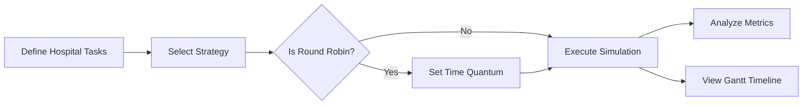

# 🏥 Smart Hospital Task Scheduling Simulator

<p align="center">
  A dual-platform (Java Swing + React Web) scheduling simulator designed to optimize resource allocation in modern healthcare environments.
</p>

<p align="center">
  
  
  
  
</p>

---

## 📖 Overview

This project is a sophisticated task scheduling simulator that bridges the gap between operating system scheduling algorithms and practical hospital resource management. It provides both a robust Java desktop application and a premium glassmorphic web dashboard to simulate how different scheduling strategies affect hospital efficiency, patient wait times, and task completion rates.

**The application is especially useful for:**
- 🏥 Optimizing triage and task prioritization in emergency departments
- 📊 Comparing scheduling efficiency (FCFS vs SJN vs RR) for medical procedures
- 🏫 Demonstrating scheduling theory in healthcare informatics coursework
- ⚡ Visualizing resource bottlenecks through interactive Gantt charts

---

## ✨ Highlights

| Area | What the project provides |
| :--- | :--- |
| **Scheduling** | `FCFS`, `SJN`, and `Round Robin` tailored for hospital tasks |
| **Interfaces** | Modern Java Swing GUI + Premium React Web Dashboard |
| **Analysis** | Real-time calculation of Turnaround Time (TAT) and Waiting Time (WT) |
| **Visualization**| High-fidelity Gantt charts showing medical task execution timelines |
| **Aesthetics** | Professional "Hospital-Tech" design system with glassmorphism |

---

## ⚙️ Supported Algorithms

| Algorithm | Healthcare Context | Notes |
| :--- | :--- | :--- |
| `FCFS` | General Admin / Triage | Tasks executed in the exact order of arrival |
| `SJN` | Fast-track Diagnostics | Prioritizes shorter tasks to minimize average wait times |
| `Round Robin` | Shared Resources / ICU | Cycles through tasks using a fixed time quantum |

---

## 🚀 Interface Workflow

The simulator follows a streamlined medical workflow from data entry to visual analysis:



---

## 🛠️ Technology Stack

| Layer | Choice |
| :--- | :--- |
| **Core Logic** | Java 11 / TypeScript |
| **Web UI** | React 18, Framer Motion, Lucide Icons |
| **Desktop UI** | Java Swing with FlatLaf Theme |
| **Build Tools** | Maven & Vite |
| **Styling** | Vanilla CSS3 (Modern Design System) |

---

## 📁 Project Structure

```text
Smart_Hospital_Simulator/
├── modern-dashboard/       # Premium React Web Frontend
│   ├── src/
│   │   ├── scheduling.ts   # Ported Scheduling Logic
│   │   └── App.tsx         # Dashboard UI
│   └── index.css           # Design System
├── src/                    # Core Java Implementation
│   └── main/java/org/hospitalscheduling/
│       ├── MainGUI.java    # Modernized Swing UI
│       ├── Scheduler.java  # Abstract base class
│       ├── HospitalTask.java # Task data model
│       ├── FCFS.java       # FCFS Implementation
│       ├── SJN.java        # SJN Implementation
│       └── RR.java         # RR Implementation
└── pom.xml                 # Maven Configuration
```

### Core Components

| Component | Responsibility |
| :--- | :--- |
| `modern-dashboard/` | High-end web interface for presentation and visualization |
| `MainGUI.java` | Main entry point for the professional desktop application |
| `HospitalTask.java` | Model for medical tasks (Arrival, Duration, Priority) |
| `Scheduler.java` | Logic engine for computing scheduling metrics and timelines |

---

## 🏃 Getting Started

### ☕ Running the Desktop Application
1. **Build the project:**
   ```bash
   mvn clean compile
   ```
2. **Run the GUI:**
   ```bash
   mvn exec:java -Dexec.mainClass="org.hospitalscheduling.MainGUI"
   ```

### 🌐 Running the Web Dashboard
1. **Navigate to directory:**
   ```bash
   cd modern-dashboard
   ```
2. **Install & Start:**
   ```bash
   npm install && npm run dev
   ```
3. **Access:** Open `http://localhost:5173`

---

## 💡 How to Use

1. **Launch** your preferred interface (Desktop or Web).
2. **Input Tasks** such as "Surgery Prep", "Radiology", or "Patient Intake".
3. **Select Algorithm** based on the hospital scenario you wish to simulate.
4. **Run Simulation** to see the engine process the tasks.
5. **Review Results** in the performance table and the visual Gantt chart.

---

## 📊 Sample Medical Data

The simulator comes pre-loaded with realistic healthcare task sets:

| Task Name | Arrival Time | Duration | Priority |
| :--- | :---: | :---: | :---: |
| `Surgery Prep` | 0 | 5 | 1 |
| `Radiology` | 1 | 3 | 2 |
| `Lab Tests` | 2 | 8 | 1 |
| `Patient Intake`| 3 | 6 | 3 |

*Note: Metrics like Completion Time, Turnaround Time, and Waiting Time are calculated automatically for every task.*

---

## 🎯 Scope & Improvement Opportunities

> **Note:** This simulator is currently a functional demonstration of scheduling theory applied to healthcare.

**Current Features:**
- Full implementation of FCFS, SJN, and Round Robin.
- Multi-platform support (Web and Desktop).
- Visual timeline rendering.

**Future Roadmap:**
- [ ] **Priority Scheduling:** Implementation of priority-based triage.
- [ ] **Real-time API:** Connect the Web UI to the Java backend via Spring Boot.
- [ ] **Data Export:** PDF/CSV reporting for hospital management.
- [ ] **Staff Constraints:** Adding resource limits (e.g., number of available doctors).

---

## 🎓 Academic Value

This project serves as a bridge between computer science and health informatics, demonstrating:
- Real-world application of scheduling algorithms.
- Cross-platform development (Java and React).
- Modern UI/UX principles in technical tools.
- Performance analysis through simulation.

---

<p align="center">
  <b>Developed by DewanMim</b>
</p>
